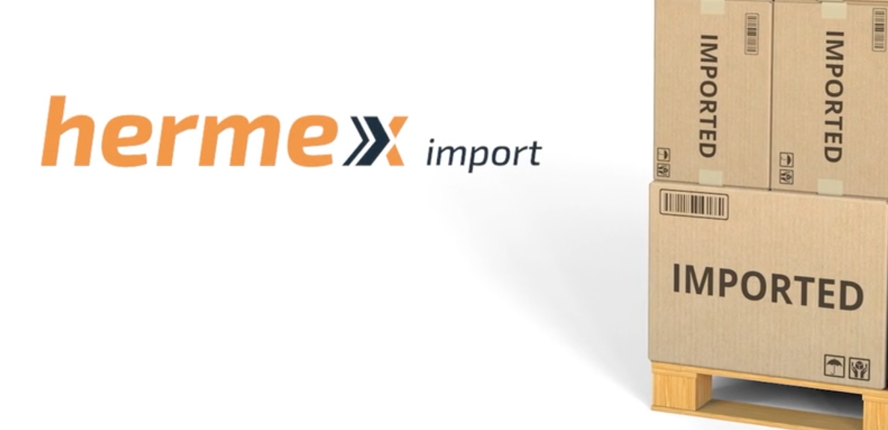

# Course: SQL Instructions Overview - Hermex Project

# SQL Instructions Overview - Practical Project

## Introduction

This repository was created to document the activities performed in the *SQL Instructions Overview* course at Alura. During the course, I explored the fundamentals of SQL through practical exercises on a fictional database from an expanding import company, *Hermex Import*. The focus was on learning how to manipulate tables and perform basic queries to meet business needs.

The course used SQLite as the database and Visual Studio Code (VSCode) integrated with the SQLTools extension to develop and test queries.

## Project Objectives

The project had the following main objectives:

- Teach how to create, alter, delete, and insert data into tables.
- Perform basic queries using filters.
- Develop essential SQL skills for beginners in the data field.
- Simulate a work environment using the Hermex Import database, providing a practical and targeted learning experience.

## Key Learnings

Throughout the course, the following concepts and techniques were covered:

### Table Creation and Manipulation
- `CREATE TABLE` and `DROP TABLE` commands for creating and deleting tables.

### Data Insertion and Manipulation
- Inserting records using the `INSERT INTO` command.
- Updating and deleting data with the `UPDATE` and `DELETE` commands.

### Simple Queries
- Data extraction using `SELECT`, `WHERE`, and `ORDER BY`.
- Using basic filters to refine queries.

### SQL Transactions
- Using transactions with `BEGIN TRANSACTION` and `COMMIT` to ensure data consistency.

### Integration with Development Tools
- Configuring Visual Studio Code to work with SQLite databases using the SQLTools extension.

## Queries Implemented

Some of the queries developed include:

1. **Creating tables to organize the data of Hermex Import**
2. **Inserting initial data to simulate the company operations**
3. **Listing imported products by country of origin**
4. **Filtering customers by region and revenue**
5. **Updating product prices in stock**
6. **Deleting records of discontinued products**

These queries demonstrate basic skills in creating, manipulating, and extracting data in SQL.

## Technologies Used

- **Database:** SQLite - Simple and ideal for initial SQL learning.
- **Development Tool:** Visual Studio Code with the SQLTools extension to facilitate interaction with the database.

## How to Run the Project

### Setting up the Environment

1. Install [Visual Studio Code](https://code.visualstudio.com/).
2. Add the [SQLTools extension](https://marketplace.visualstudio.com/items?itemName=mtxr.sqltools).
3. Download the SQLite database file provided in the course.

### Running the Queries

1. Open Visual Studio Code.
2. Set up the connection to the SQLite database using the SQLTools extension.
3. Execute the available SQL queries in this repository to explore the Hermex Import data.

## Conclusion

Upon completing this project, I developed fundamental SQL skills, from creating and manipulating tables to performing basic queries with filters. This learning serves as an important foundation to progress into more complex data analysis and work on real-world data projects.

---
